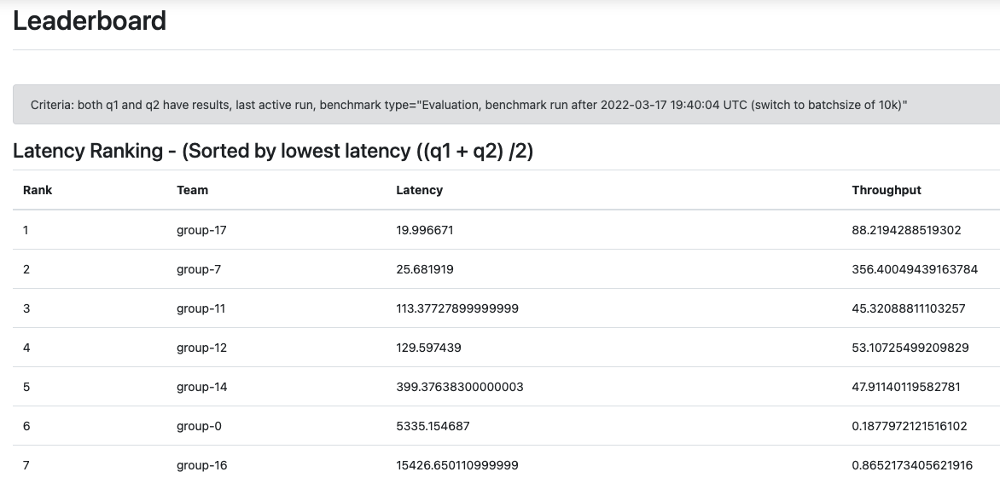
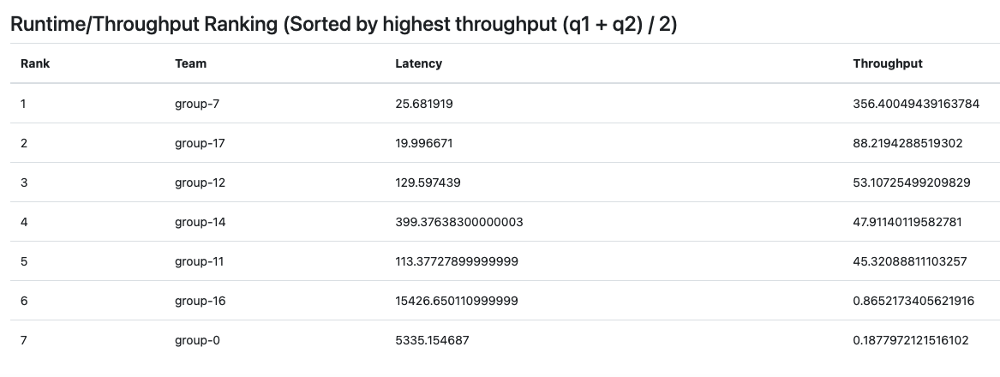

# GROUP 17 Implementation 

This repository is the group 17 of the ACM DEBS 2022 Grand Challenge. 

https://2022.debs.org/call-for-grand-challenge-solutions/


# Screenshots of DEBS 2022 Grand Challenge Evaluation System 




# Java Implementation 


```
gradle clean build run 
```

Higher performance with Java implementation is achieved. 


# Python Implementation 

## Running locally
Change into the `python` directory.

**Install the required packages**:

```shell
pip3 install grpcio
pip install grpcio-tools
```

Or use:
```shell
pip3 install -r requirements.txt
```

**Create the Protobuf messages**:
```shell
make messages
```
**Running the code**:
```shell
python3 solution.py
```

Run it with different number of Event Consumer and Producers and queue size based on avaialble CPU and RAM. 


```shell
python3 solution.py  --num_producers 4 --num_consumers 16 --queue_size 10 
```


**Options**:
```shell
python3 solution.py --help
```
Able to tune the number of producers, consumers, and the queue size for the producers and consumers.


# Server-Side System Implementation
The server-side of the DEBS 2022 Grand Challenge Implementation is here:

https://github.com/jawadtahir/CHALLENGER 

